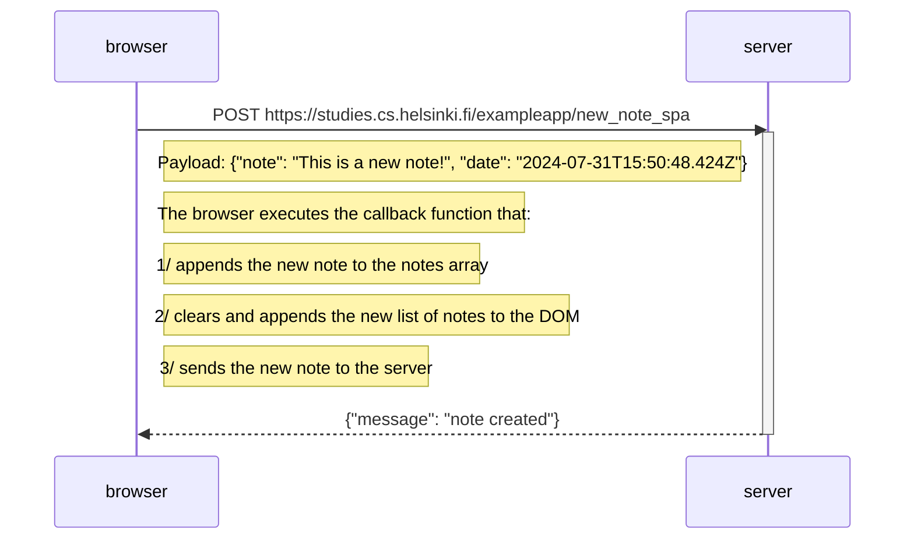

```mermaid
sequenceDiagram
    participant browser
    participant server

    browser->>server: POST https://studies.cs.helsinki.fi/exampleapp/new_note_spa
    activate server
    Note right of browser: Payload: {"note": "This is a new note!", "date": "2024-07-31T15:50:48.424Z"}
    Note right of browser: The browser executes the callback function that:
    Note right of browser: 1/ appends the new note to the notes array
    Note right of browser: 2/ clears and appends the new list of notes to the DOM
    Note right of browser: 3/ sends the new note to the server
    server-->>browser: {"message": "note created"}
    deactivate server
```